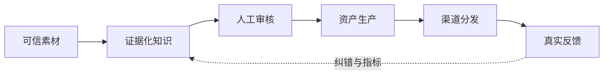

<!-- generated by portfolio-upgrade; edit portfolio.json, not this file -->
# earn10m 扩展升级规格

> 资产域：内容生产  
> 证据状态：可运行原型  
> 组合去向：修复后试点  
> 生成源：工作区根目录的 `portfolio-upgrade/portfolio.json`

## 1. 当前价值与边界

- **已验证价值：** 公开站、四类飞书数据、Telegram 入口和安全同步底座已有 13 项回归测试；Next.js 已升至 16.2.10，PostCSS 固定到修复版 8.5.17，npm audit 为 0，lint 与生产构建通过。
- **当前阻断：** 真实同步仍缺持久 run ID，超过 200 条尚无有界分页，敏感扫描与完整 manifest 未完成；小时任务仍在运行，Bot 仍是旧内存代码。
- **组合关系：** 复用 himcn-data 的安全写入模式。

“已验证资产”只代表某个核心数据、算法或内容已被复核，不代表项目可以直接生产运行。

## 2. 本轮扩展目标

增加有界分页、持久运行 manifest 和敏感内容扫描；保持发布人工批准，并将 Bot 迁移到同一可回滚状态存储。

## 3. 目标闭环

## 4. 扩展范围

### Now：先解除阻断

1. 把当前阻断固化为可重复失败样例。
2. 先补 schema、不变量、权限或来源门禁，再扩展新功能。
3. 所有失败必须非零退出或进入隔离队列，不得静默降级成正常结果。

### Next：形成可复用能力

1. 每次运行保存 commit、输入 hash、配置、时间、模式和结果 manifest。
2. 把可复用组件做成稳定接口，并按“复用 himcn-data 的安全写入模式。”收口重复实现。
3. 增加人工审核、回滚和 last-good 基线。

### Later：小范围真实验证

1. 只选择一个真实用户旅程或数据批次试点。
2. 预先定义成功、失败和停止条件。
3. 只有跨周期可复现且风险门通过，才从 experimental 升为 verified；production 需独立评审。

## 5. 验收门禁

- [ ] PRD、LOOP、UPGRADE 与实现使用同一事实口径。
- [ ] 固定成功 fixture、失败 fixture 和边界 fixture 全部自动化。
- [ ] 来源、截至时间、权利、隐私、模式和审核状态可追溯。
- [ ] 生产路径不接受 Mock、占位符、未知零值或未批准推演。
- [ ] 写入采用 dry-run、限量、原子替换、回读验证和可恢复快照。
- [ ] 依赖、秘密、权限、XSS/SSRF 与高敏数据门禁按风险适用。
- [ ] 关键业务数值由产物复算，不在页面或报告中手填。
- [ ] 发布后指标和纠错进入 LOOP，并形成新测试或规则。

## 6. 退出条件

完成本轮扩展目标、所有适用门禁通过，并提供一份可复现证据包后，才能进入“修复后试点”的下一阶段。证据包至少包含测试结果、运行 manifest、人工复核记录、剩余风险和回滚方法。
